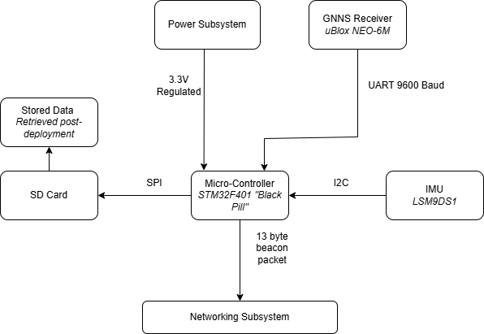
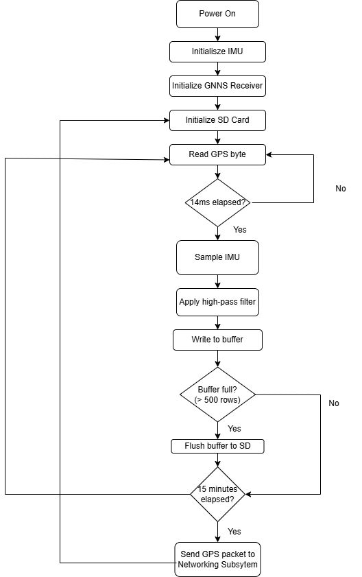

# SIREN: Sea Ice Remote Environmental Node

**A low-power sensing buoy that logs ice-floe motion in the Antarctic Marginal Ice Zone (MIZ).**
EEE4113F Engineering Design, University of Cape Town, March–June 2026 · Group 9: Maarij Alam, Ebrahim Bhyat, Josh Smith, Boitseko Senamela

This repository contains the **sensing subsystem** (Maarij Alam): STM32 firmware that samples a 6-DoF IMU and GPS, logs raw data to an SD card for post-processing on land, and hands position beacons to the comms subsystem. It also holds the acceptance-test firmware, analysis scripts and hardware design files.



## Hardware
| Part | Interface | Pins (STM32F401CE "Black Pill") |
|---|---|---|
| LSM9DS1 IMU (accel + gyro) | I2C | SDA PB7, SCL PB6 (addr 0x6A) |
| u-blox NEO-6M GPS | UART2, 9600 baud | RX PA3, TX PA2 |
| MicroSD card (FAT32) | SPI | CS PB12 |
| ESP32 comms subsystem | UART1 | TX PA9, RX PA10 |

Firmware is C++ on the STM32duino core (Arduino IDE), flashed over SWD with an ST-Link V2. Schematics were drawn in KiCad.

## What the firmware does
[`firmware/SIREN_integrated/SIREN_integrated.ino`](firmware/SIREN_integrated/SIREN_integrated.ino)
- Samples the IMU at **~71 Hz** on a fixed timer, with a **high-pass filter** on vertical acceleration to remove gravity and drift (used for wave and collision detection).
- Parses GPS **NMEA $GPRMC** sentences **non-blockingly**, so a slow UART never stalls sampling.
- Buffers 500 rows in RAM and **flushes to `siren.csv` in blocks**, keeping SD writes off the sampling path.
- Answers `GET_DATA` requests from the ESP32 comms board with a position beacon (`ts,lat,lon` + `END_OF_DATA`).



## Results
- **42,600 IMU samples** logged over a 10-minute run with **zero corrupted fields**.
- **71 Hz** achieved over I2C. The 100 Hz target was limited by I2C overhead; SPI was identified as the path to a higher rate.
- **65–75 mA** steady-state, ~100 mA peak, inside a **150 mA** power budget.
- Wave detection resolved the **1.05 Hz** test motion at **17.7 dB SNR**.
- GPS: **59.9 fixes/min**, 22.3 m accuracy under multipath.
- **7 of 9** acceptance tests passed.

## Acceptance tests
Every ATP has firmware (`.ino`) plus a Python script that validates the CSV it produces. See [`acceptance-tests/`](acceptance-tests).

| ATP | What it tests | Pass criteria |
|---|---|---|
| 1 | MCU boot | All peripherals initialise; 3.3 V rail 3.2–3.4 V |
| 2 | IMU static | Flat 9.81 ± 0.5 m/s², 45° 6.94 ± 0.5 m/s², filtered < 0.1 m/s² |
| 3 (tap) | Collision detection | Spike > 2 × RMS for ≥ 2 consecutive samples |
| 3 (shake) | Wave simulation | 1.0 ± 0.1 Hz peak, SNR ≥ 10 dB |
| 4 | GPS accuracy | Fix < 5 min, error < 10 m, 60 ± 3 sentences/min |
| 5 | SD integrity | Expected row count, zero nulls, no gaps > 15 ms |
| 6 | Current draw | IMU 4–6 mA, GPS 35–50 mA |
| 7 | Beacon packet | Matches GPS, correct interval and format |
| 8 | Endurance | Zero errors over a long run |

<!-- TODO (Maarij): add a "Result" column (PASS/FAIL + measured value) from the final report. -->

## Repository layout
```
firmware/
  SIREN_integrated/      full integrated firmware (IMU + GPS + SD + comms)
  bringup/               single-peripheral bring-up sketches (imutest, gps_test, sd_test, integration_t1)
acceptance-tests/atp_1…8 test firmware, captured CSVs, validate.py scripts, result plots
hardware/                KiCad schematic/PCB (sensing_board/), SPI variant schematic, pinouts
sims/                    signal simulation and spectrum of the expected wave motion
docs/                    block diagram and firmware flow
```

## Running the analysis
```bash
pip install numpy scipy pandas matplotlib
cd acceptance-tests/atp_5 && python validate.py      # e.g. SD integrity check on ATP5_DAT.CSV
```

---
Sensing subsystem by **Maarij Alam** · [maarijbhai.github.io](https://maarijbhai.github.io) · [project write-up](https://maarijbhai.github.io/projects/antarctic-remote-sensing/)
